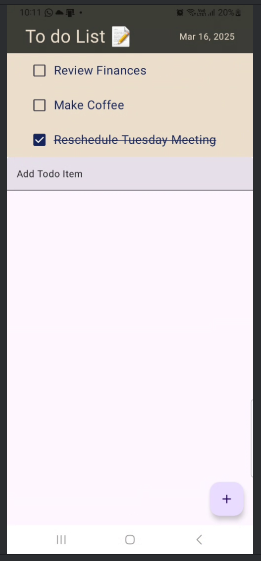

# Kotlin Todo App

A simple Kotlin based Todo application to keep a track of all the day to day activities without a
lot of clutter!

## Features

- Add Todo Items
- Change Status of Todo Items using Checkbox
- Delete Completed tasks using swipe to delete
- Display Current Date